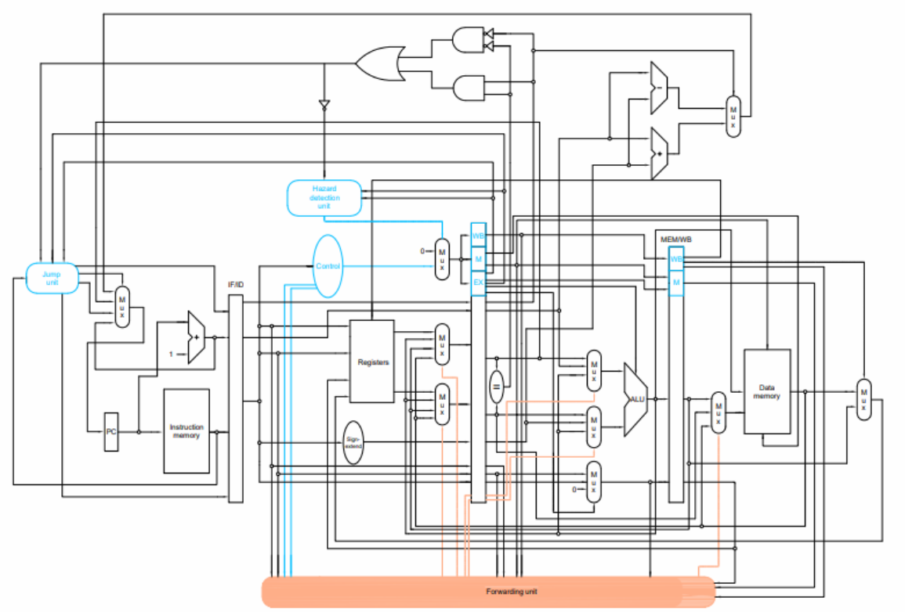
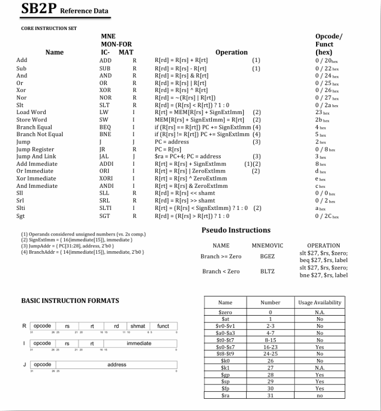

# Cycle-Accurate-Simulator for a 5-stage MIPS pipeline processor

this project is multithreaded simulation environment for the pipeline processor, the cause was to make simulation time faster for larger benchmarks. 
although this project didnt really see big benchmarks to make use of the faster simulation times, it was tested on specific edge cases. 
the benifits of this project was by getting started with simulations and multithreaded environments and to somewhat create an evaluation environment between multiple pipeline designs and a signle cycle design. 
altough this software was not completed fully it works for the architecture provided below, the design itself was implemented also in verilog and tested using ModelSim and it is also documented can be found in the following repo: SB-2P/Pipeline-SingleCycle-design-evaluation.

# Documentation on how to operate
[Full PDF here](Document/HowToOperate.pdf)

# Datapath view 

# refrence sheet 

the assembler can be tricky to handle but if you follow the example found in the ../temp_insutrctions.txt file then you should be good to try the program.   
note: the architecture was designed with 0-based word addressable memory, so trying a MARS program on here wont functoin correctly unless you configure the memory addressing on either end to be word addressable. 

# Credits 
this project was done by my team "SB2P" :   
Abdelrahman Samha  
Ehab Sbieh  
Ahmad Al-hajj  
Nermeen Dawoud  

# branches
other branches found in the repository were for testing and future refrence, some of which dont even function properly or work. but i keep them because they contain examples on multithreaded environment behaviors that can be useful at somepoint later on. 
